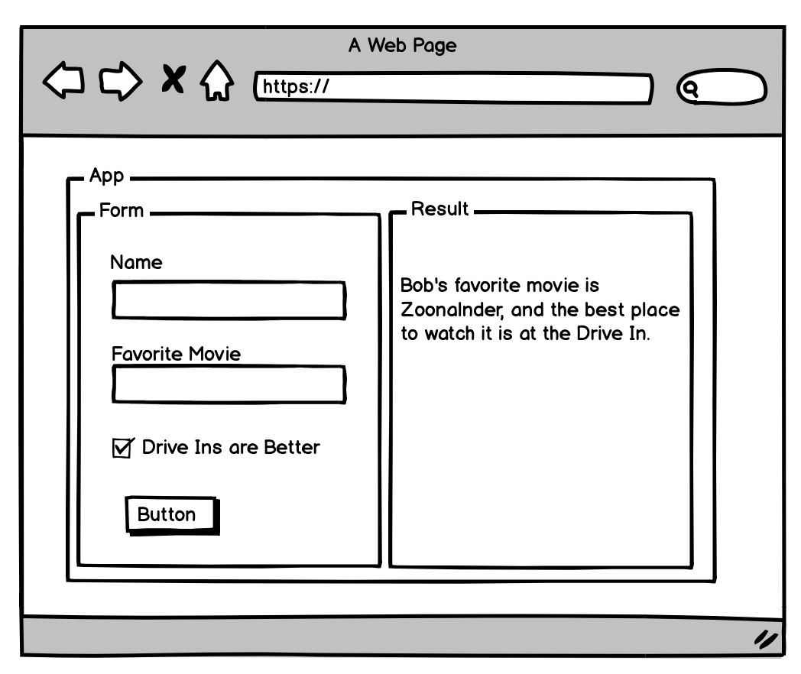

# Passing Behavior as a Prop

Now we know that state manages data inside of a component, and props allow us to pass data from a parent component to a child component.  There's one question left to ask: How do we pass information from a child component back up to its parent?  This kind of thing needs to happen all of the time.  Imagine the following React application:



Here we have 3 components, a main application, a Form component and a Result component.  We decide that all of the state in this application will be maintained in App, and we'll pass data between the form and the result via props.

Getting back to our question, how do we pass information from a child component (the Form component in this case) back up to the App, so it can pass it along to Result component?

The asnswer may surprise you: We can't.  There is no way in React to pass data back up from a child component to a parent.

Not one, ...nada, .... zilch, ... it isn't going to happen.

So how do we accomplish an application like this?  The answer is passing a function from the parent to the child (from App to Form in the app above).  To see exactly how this is going to help us, first we need to revisit scope.

### Reviewing Scope

Concider this code:

```javascript
function getGreeter(){
  const greeting = "Hello"
  return function(name){
    return `${greeting} ${name}`
  }
}

const greeter = getGreeter()
console.log(
  ["Bobbie", "James"].map( name => greeter(name))
)
```
```result
: [ 'Hello Bobbie', 'Hello James' ]
```
We gain closure over the 'greeting' variable in the function that 'getGreeter()' returns, and it remains in scope.  A very similar thing happens in the methods of Javascript classes, and we take advantage of it in React.

### Passing Methods as Props
So, how can we use class methods in props to solve our form problem in the app above?  We know that we can pass props down from parent to child component, so let's pass down a method to the child that maintains the parent's state in scope, and when the child component changes, it can call that method and the parent's state will be updated.

Let's look at an example to help make this clear:

```html
: <!DOCTYPE html>
: <html lang="en" dir="ltr">
:   <head>
:     <meta charset="utf-8">
:     <script src="https://unpkg.com/react@16/umd/react.development.js" crossorigin></script>
:     <script src="https://unpkg.com/react-dom@16/umd/react-dom.development.js" crossorigin></script>
:     <script src="https://unpkg.com/@babel/standalone/babel.min.js"></script>
:     <title>Intro to React</title>
:   </head>
:   <body>
:
:     <div id="react-container"></div>
:
:     <script type="text/babel">
:       class HelloReact extends React.Component{
:         constructor(props){
:           super(props)
:           this.state={
:             color: 'blue'
:           }
:         }
:
:         colorChanged = (color)=>{
:           this.setState({color: color})
:         }
:         render(){
:           const{ color } = this.state
:           return(
:             <div>
:               <ColorChooser
:                 onChange={this.colorChanged}
:               />
:               <ColorBox
:                 color={color}
:               />
:             </div>
:           )
:         }
:       }
:
:       class ColorChooser extends React.Component{
:         handleRedClick = ()=>{
:           this.props.onChange('red')
:         }
:
:         handleGreenClick = ()=>{
:           this.props.onChange('green')
:         }
:
:         render(){
:           return(
:             <div>
:               <button
:                 onClick={this.handleRedClick}
:               >
:                 Make it Red!
:               </button>
:               <button
:                 onClick={this.handleGreenClick}
:               >
:                 Make it Green!
:               </button>
:             </div>
:           )
:         }
:       }
:
:       class ColorBox extends React.Component{
:         render(){
:           return(
:             <h1
:               style={{backgroundColor: this.props.color }}
:             >
:               Hello React
:             </h1>
:           )
:         }
:       }
:       const domContainer = document.querySelector('#react-container');
:       ReactDOM.render(<HelloReact />, domContainer);
:     </script>
:   </body>
: </html>
```

Notice that we only need to maintain state in the parent App component.  You can begin to think of state in your application like an upsidedown tree.  It flows from a few smart parent components through all of the nested child components.


#### Where To From Here?

[Practice with the Dice Roller](./08dice_roller.md)

[Back to State and Props](./06react_state_and_props.md)
